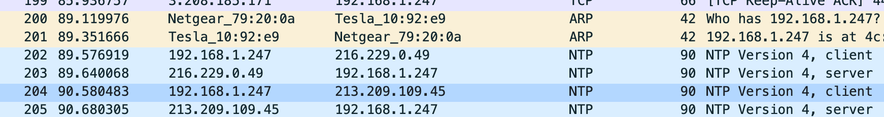

# Generate and Use Expired ODIN Tokens

**CVE:** [CVE-2022-42007](https://cve.mitre.org/cgi-bin/cvename.cgi?name=CVE-2022-42007)
**CWE:** CWE-613 (Insufficient Session Expiration), CWE-294 (Authentication Bypass by Capture-replay)
**Submitted:** September 4, 2021
**Affected:** Tesla Toolbox API + all Tesla vehicles
**Kernel:** Linux ice 4.14.235-PLK #1 SMP PREEMPT (x86_64)
**Firmware:** 2021.24.4
**Status:** Fixed in firmware 2021.32.10
**Reward:** Bugcrowd bounty (TBX3-7577)

## Testing Environment

| Field | Value |
|-------|-------|
| Vehicle | Tesla Model 3 |
| MCU | Intel Atom (x86_64) |
| Kernel | 4.14.235-PLK |
| Firmware | 2021.24.4 |
| Access | WiFi (wireless, not wired) |
| Network | Local WiFi, attacker on same network as car |
| NTP Spoofing OS | Ubuntu 20.04.3 LTS |
| Date | September 2021 |

## Description

Three related vulnerabilities allow an attacker to generate and use ODIN tokens beyond their intended expiration:

1. **Expired token acceptance:** The ODIN token generation endpoint (`https://toolbox.tesla.com/api/v1/auth/odin_token`) accepts expired `tbx-tokens`, generating ODIN tokens that are also expired.

2. **Token leakage:** The ODIN token generation endpoint returns the user's `tbx-token` in the response, even though it is not needed to run ODIN tasks. This increases the risk of token sharing and abuse.

3. **NTP time spoofing:** Expired ODIN tokens can be used on a vehicle by spoofing the car's NTP time source, causing the car to believe the tokens have not yet expired.

## Steps for Reproduction

### 1. Generate an ODIN token with an expired tbx-token

```bash
curl https://toolbox.tesla.com/api/v1/auth/odin_token \
    -d '{"product_id":"${VIN}"}' \
    -H "Authorization: Bearer ${TBX_TOKEN}"
```

The endpoint accepts expired `tbx-tokens` and returns a response containing all three token types:

```json
{
    "tbxtoken": "${TBX_TOKEN}",
    "token": "${ODIN_TOKEN}",
    "tokenv2": {
        "token": "${ODIN_TOKEN_V2}",
        "intermediate_certificate": "${INTERMEDIATE_CERT}"
    }
}
```

### 2. Spoof the car's NTP time

Connect the Tesla to the same WiFi network as the attacker machine. The attacker's connection must be wireless. Run the custom NTP spoofing script (see [tools/ntpspoof.py](tools/ntpspoof.py)):

```bash
python3 ntpspoof.py 192.168.1.247 wlan0
```

The script intercepts NTP responses using ARP spoofing and rewrites timestamps to a date before the token's expiration. For a higher success rate, reboot the car by holding both steering wheel scroll wheels for 10 seconds. For guaranteed success, disconnect the cellular antennae from the MCU first. It may take up to ~15 minutes for the spoofed time to take effect.

Success can be validated using Wireshark by checking the "origin timestamp" in NTP requests from the car:



### 3. Use the expired tokens

Once the car believes the spoofed time, ODIN will accept tokens that expired after that time. Tokens that expired before the firmware's build date are still rejected.

## Impact

This vulnerability chain allows anyone with a `tbx-token` (current or expired) to generate and use ODIN tokens indefinitely. Combined with the token leakage issue, individuals who share generated ODIN tokens with others inadvertently share their `tbx-token` as well, which could then be used to generate further ODIN tokens without the original user's knowledge.

This is especially dangerous in the case of a higher-principled token (such as `tbx-engineering`) being leaked and then abused.

## Recommendations

- Disallow the use of expired `tbx-tokens` on the ODIN token generation endpoint by decoding the JWT and checking the expiry time.
- Remove the `tbx-token` from the ODIN token generation response, as it is not needed for using ODIN.
- The vehicle gateway already detects when time has been set in the past (message `GTW_w149_rtcTimeSetInPast`). Use this signal to require a higher principal-level token or disable ODIN entirely when NTP tampering is detected.

---

**Researchers:** Matthew C. Pilsbury, Alex Harbuzenko, Oleg Kutkov
Research conducted at SourceHat Labs Inc.
