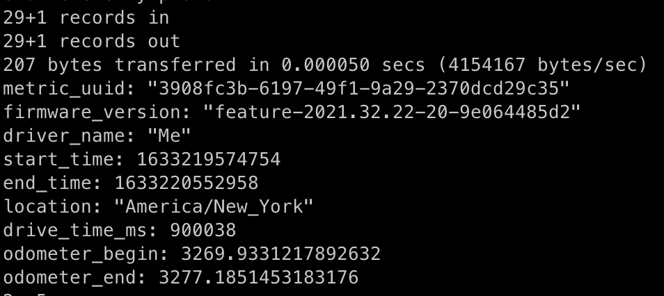
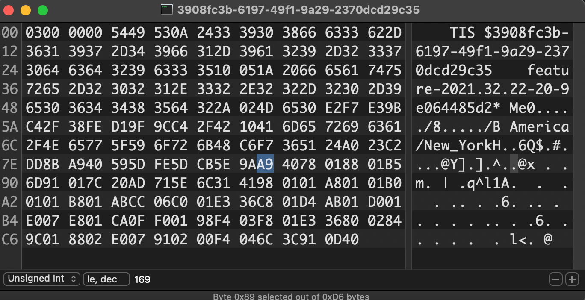
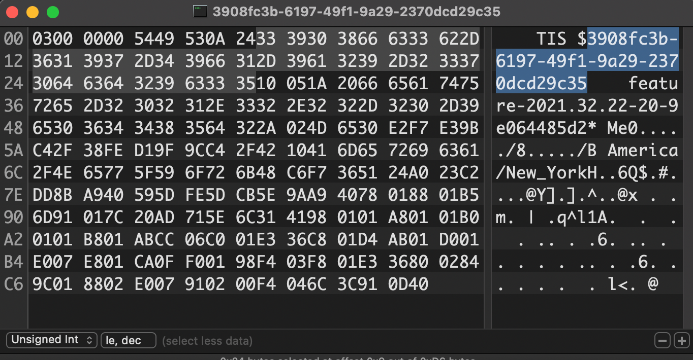
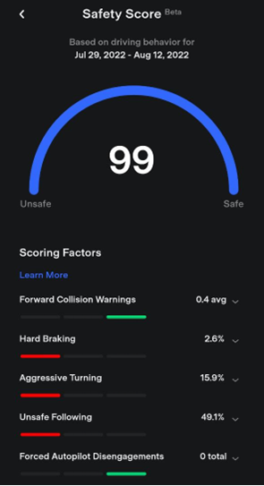
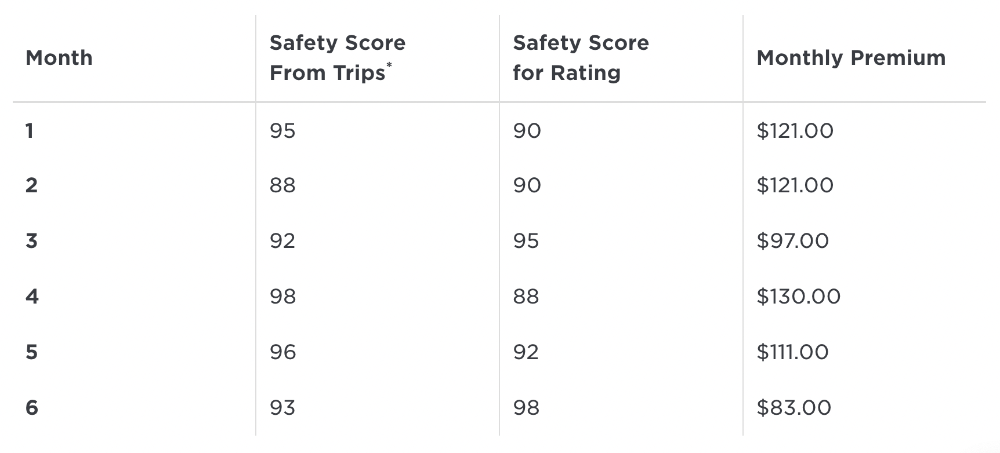

# Providing Fake Insurance Telemetry (Safety Score) Data

| | |
|---|---|
| **CVE** | — |
| **CWE** | CWE-345 (Insufficient Verification of Data Authenticity) |
| **Submitted** | November 19, 2021 |
| **Affected** | Tesla Model 3/Y (Intel MCU), likely Model S/X |
| **Kernel** | Linux ice 4.14.235-PLK #1 SMP PREEMPT (x86_64) |
| **Firmware** | 2021.32.22 |
| **Status** | No fix confirmed. As of the August 2023 blog publication, while the protobuf definitions had changed, the underlying architecture (telemetry submitted from the MCU rather than the autopilot unit) had not. |
| **Reward** | No reward issued |

## Testing Environment

| Field | Value |
|-------|-------|
| Vehicle | Tesla Model 3 |
| MCU | Intel Atom (x86_64) |
| Kernel | 4.14.235-PLK |
| Firmware | 2021.32.22 |
| Access | SSH (requires prior root access) |
| Telemetry | Enabled via FSD Beta Request Queue opt-in |
| Date | November 2021 |

## Description

Tesla's Safety Score system assesses driving behavior using telemetry data collected by the vehicle. This data is used to calculate Tesla Insurance premiums and was previously used to gatekeep entry to the FSD Beta program.

An attacker with root access on the MCU can create fake telemetry samples with perfect safety scores and inflated mileage, then submit them to Tesla's Mothership server to artificially improve their Safety Score — directly reducing their insurance premiums.

The core issue is that Safety Score telemetry originates from the MCU (car computer), which is accessible to a rooted user, rather than from the autopilot unit (APE3), which has substantially stronger security controls.

## Steps for Reproduction

### 1. Generate a perfect telemetry sample

With root access and telemetry collection enabled, drive at least 0.1 miles extremely carefully to achieve a 100/100 safety score. Before placing the car into park, run the following script to capture the telemetry data before it's uploaded and deleted:

```bash
#!/bin/sh
while true; do
    cp /home/tesla/.Tesla/data/drivemetrics/* /home/tesla/
    sleep 0.02
done
```

After parking, wait approximately 2 minutes for the Safety Score to appear in the Tesla app, then copy the saved telemetry files from `/home/tesla/` to a local machine.

### 2. Analyze the telemetry format

The telemetry samples use Protocol Buffers (protobuf). The full reverse-engineered schema is available at [tools/telemetry.proto](tools/telemetry.proto). The key fields for this attack are the odometer readings and UUID.

Decode a sample using `protoc`:

```bash
dd if=<sample-filename> skip=1 bs=7 | protoc --decode TisDriveRecord telemetry.proto -I.
```

Output:

```
drive_record_id: "3908fc3b-6197-49f1-9a29-2370dcd29c35"
firmware_version: "feature-2021.32.22-20-9e064485d2"
driver_profile_name: "Me"
start_epoch_ms: 1633219574754
end_epoch_ms: 1633220552958
timezone: "America/New_York"
drive_time_ms: 900038
start_odometer: 3269.9331217892632
end_odometer: 3277.1851453183176
```



### 3. Modify the odometer value

Using a hex editor, locate the odometer ending value in the binary data. The field order in the protobuf encoding follows: location, drive time, then odometer readings — so the odometer bytes appear shortly after the "America/New_York" string in the ASCII view.



Through iterative hex editing and re-decoding, changing the byte at offset 0x89 (value `0xA9`) to `0xB2` inflates the ending odometer dramatically:

```
end_odometer: 4762.3702906366352
```

This represents an increase of ~1,500 miles in a single sample.



### 4. Modify the UUID

Each telemetry sample requires a unique UUID. Using the hex editor, the UUID is clearly visible in the binary data. Change a single byte (e.g., the last `0x35` to `0x37`) to create a new unique identifier. The filename must also be updated to match the new UUID.

### 5. Create multiple samples

Repeat the UUID modification process to create multiple samples from the same perfect-score base. Each file has the same driving data (100/100 score) but a unique identifier and inflated mileage.

### 6. Upload to Mothership

Place the modified samples in `/home/tesla/.Tesla/data/drivemetrics/`, ensuring they are owned by the `tesla` account with correct permissions.

The samples are uploaded to Mothership either after a drive or upon a firmware update. Using this method, two fabricated trips were successfully uploaded and incorporated into the Safety Score — one showing approximately 2,700 miles driven in 3.5 hours, and another showing approximately 1,900 miles traveled in 35 minutes.





## Impact

This vulnerability allows anyone with root access to submit fake telemetry data that directly reduces Tesla Insurance premiums:

| Month | Safety Score (Trips) | Safety Score (Rating) | Monthly Premium |
|-------|---------------------|-----------------------|-----------------|
| 1 | 95 | 90 | $121.00 |
| 2 | 88 | 90 | $121.00 |
| 3 | 92 | 95 | $97.00 |
| 4 | 98 | 88 | $130.00 |
| 5 | 96 | 92 | $111.00 |
| 6 | 93 | 98 | $83.00 |

This unjustly decreases Tesla's revenue from their insurance business, makes their insurance model calculations less accurate, and may amount to insurance fraud by the exploiter.

None of the researchers reporting this vulnerability use Tesla insurance, nor would any perform any action which could constitute insurance fraud.

## Recommendations

Source the Safety Score telemetry data from the APE3 (autopilot) unit rather than the MCU. The APE3 is substantially harder to compromise and has additional encryption and security measures. Encrypt the telemetry data using APE3's device keys, similar to how the `crypto_key` is delivered to APE3 for firmware decryption.

This would also prevent users from clearing their driving data for an ongoing trip by placing the car into park after performing a two-scroll-wheel reset.

---

**Researchers:** Matthew C. Pilsbury, Alex Harbuzenko, Oleg Kutkov
Protobuf schema credit: Tristan Rice
Research conducted at SourceHat Labs Inc.
